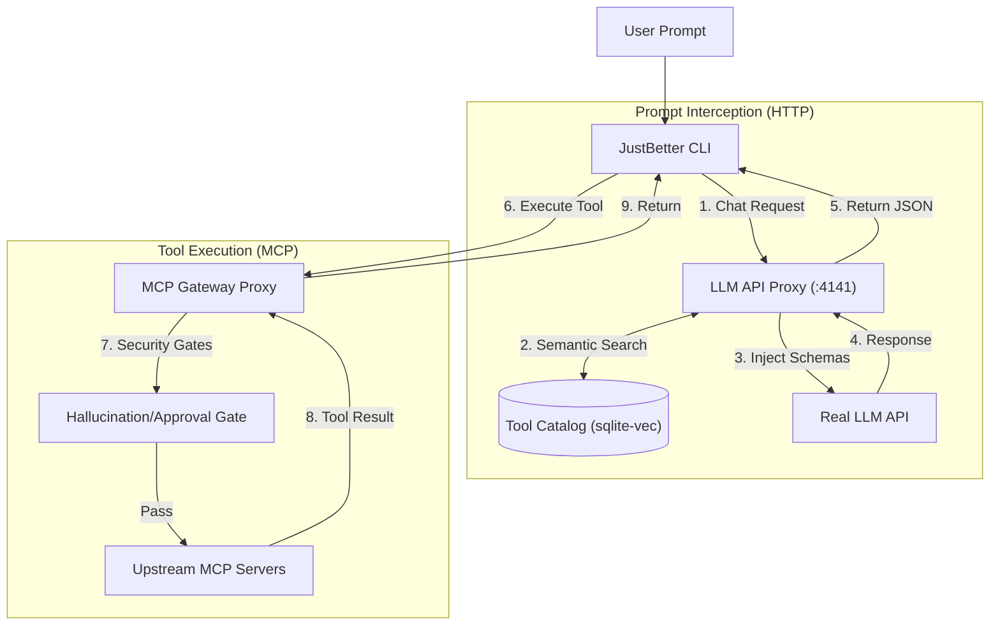
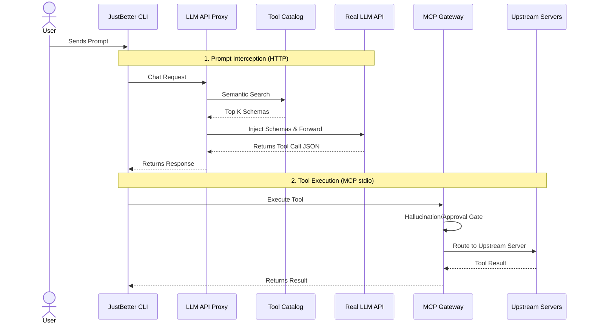
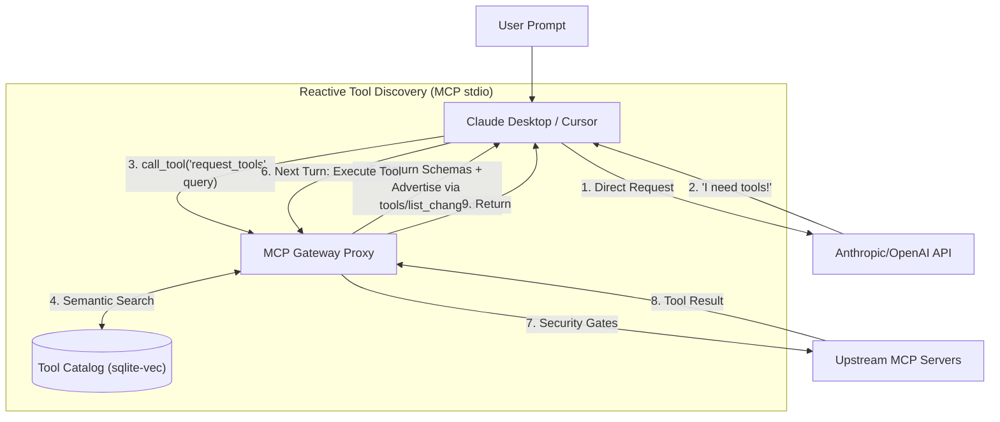
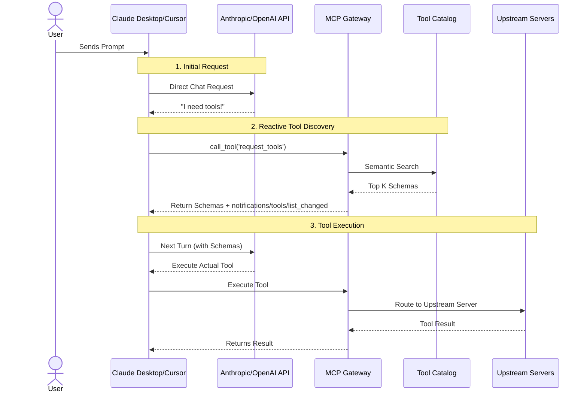
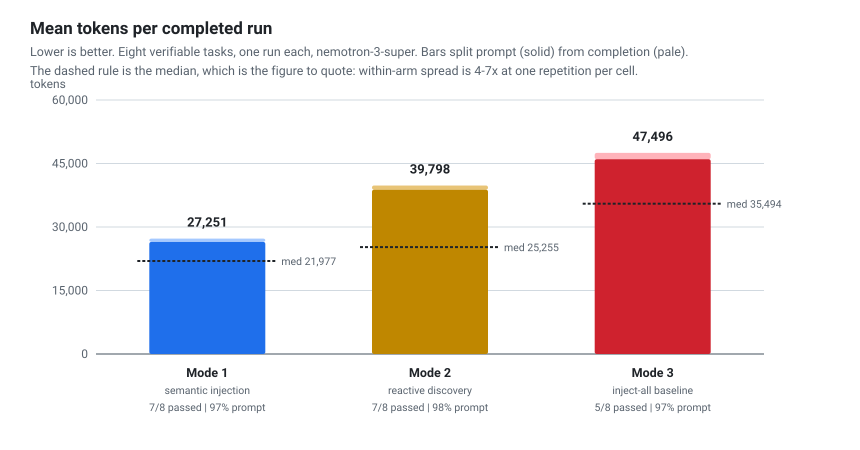
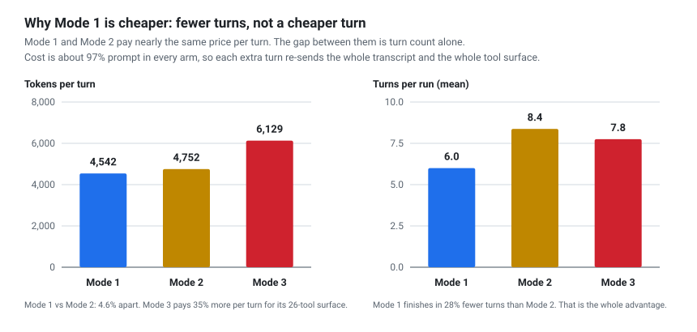
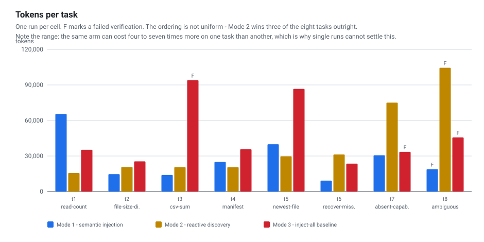

<div align="center">
  <h1>JustBetter MCP</h1>
  <p><em>An MCP gateway with dynamic, retrieval-based tool injection.</em></p>
  <p>
    <a href="https://www.npmjs.com/package/justbetter-mcp"></a>
    
    
    
    
    
  </p>
</div>

<br/>

> **The Problem:** 
> Connecting an LLM to standard Model Context Protocol (MCP) servers (like a file system, a web searcher, and a database) dumps dozens or hundreds of tools into the LLM's context window. 
>
> This token-bloat problem leads to `node_modules` blowups, context limits being breached, and severely degraded tool selection accuracy.

> **The Solution:** 
> JustBetter MCP solves this by acting as a gateway/proxy. Instead of dumping every connected server's tools into every request, it uses dynamic, retrieval-based tool injection to limit the tools sent to the LLM. 
>
> It operates in two main modes: **Mode 2** is essentially equivalent to Anthropic's MCP Tool Search or OpenAI Codex's tool search, where the LLM reactively asks for tools mid-conversation. **Mode 1** is our custom approach that performs semantic retrieval on the raw prompt *before* the first LLM call.
>
> In a controlled 24-run benchmark, Mode 1 was the cheapest of the three strategies and Mode 3 (dump everything) the most expensive. The mechanism turned out not to be the one we first assumed: Mode 1 and Mode 2 cost almost the same **per turn** — the saving is that Mode 1 needs **29% fewer turns** to finish, because the schema it needs is already there rather than one round-trip away. See [Token Usage Analysis](#token-usage-analysis).

---

## Install

```bash
npx justbetter-mcp
```

The first run opens a setup wizard: pick a provider, paste an API key (verified against the
provider before it is saved), choose a model, and choose which folder the agent is allowed to
read and write. There is no JSON to hand-author.

**Mode 2 — Claude Desktop, Cursor, or any MCP client.** Add this to the client's MCP config:

```json
{
  "mcpServers": {
    "justbetter": {
      "command": "npx",
      "args": ["-y", "justbetter-mcp", "gateway"]
    }
  }
}
```

The client starts with `request_tools`, `batch_call` and your pinned tools. Everything else is
retrieved on demand: when `request_tools` finds something, its schema is added to the server's
tool list and the client is notified — that is the whole point.

> **Mode 1 needs a client that lets you set an OpenAI-compatible base URL.** The bundled TUI is
> the reference client and always works. Cline, Roo, Continue, aider and Zed accept a custom base
> URL; Cursor is inconsistent across versions; **Claude Desktop cannot, and is Mode 2 only.**

State lives in `~/.justbetter-mcp` — config, tool catalog, and the embedding model. Nothing is
written into the directory you run from. Full reference: [Setup & Quickstart](#setup--quickstart).

---

### Quick Links
- [Install](#install)
- [Architecture & How It Works](#architecture--how-it-works)
- [Token Usage Analysis](#token-usage-analysis)
- [Benchmark Report (PDF)](docs/benchmark-report.pdf)
- [Setup & How to Use](#setup--quickstart)

---

## Architecture & How It Works

JustBetter MCP operates in two distinct modes depending on your configuration and client ecosystem.

### Mode 1: Semantic Prompt Injection (JustBetter CLI)

When using the JustBetter CLI with semantic injection enabled (`"semanticPromptInjection": true`), the gateway acts as a dual-proxy. It intercepts the HTTP chat request, performs a semantic search on the prompt, and silently injects the exact tools needed into the payload *before* it reaches the LLM.

#### Flowchart Style


#### Sequence Diagram Style


### Mode 2: Reactive Tool Discovery (Cursor, Claude Desktop & CLI)

This mode is used natively by third-party clients like Claude Desktop and Cursor, and can be enabled in the JustBetter CLI by setting `"semanticPromptInjection": false`.

In this mode, the gateway employs a reactive approach. It hides the massive catalog of upstream tools to prevent token bloat and advertises only the `request_tools` and `batch_call` primitives plus your pinned tools. The AI explicitly asks the Gateway for tools mid-conversation when needed; the matched schemas are returned in the response *and* added to the gateway's `tools/list`, which is re-announced with a `notifications/tools/list_changed`. This mirrors the behavior of Anthropic's MCP Tool Search and OpenAI Codex's tool search, trading one extra round-trip for massive context savings.

The advertised set is capped (24 discovered tools) and evicted oldest-first, so a long session cannot quietly grow back into the dump-everything baseline. Clients vary in how they react to `tools/list_changed` — some re-read immediately, some only on restart — so the discovered schemas also come back in the `request_tools` result, and `batch_call` accepts any of those names. A discovered tool is therefore callable in the same turn regardless of what the client does with the notification.

#### Flowchart Style


#### Sequence Diagram Style


### Tool Retention: what stays available between turns

Retrieval alone is not enough. A tool found on turn 3 has to still be there on turn 6, or the model
rediscovers it and pays for the discovery twice. Both modes therefore keep a bounded working set
across turns — Mode 1 as a carry-over window added to each turn's fresh matches, Mode 2 as the
advertised `tools/list`. Two rules govern that set:

- **Ordered by true recency.** Retention uses a monotonic per-injection sequence number, not the
  `injected_at` wall-clock column. SQLite's `CURRENT_TIMESTAMP` resolves only to the second, so
  every tool injected within the same turn shared one timestamp and the ordering silently
  collapsed to its tiebreak — alphabetical by tool name. A tool late in the alphabet, `write_file`
  among them, could never survive the window. It now survives on the basis the design always
  claimed.
- **What the model asked for outranks what the gateway guessed.** A tool the model obtained
  through `request_tools` is marked as *requested* and sorts ahead of the routine per-turn
  injections, stickily for the rest of the session. Without this, a dozen-odd speculative
  injections per turn could evict the one tool the model had deliberately gone looking for.

The set stays capped either way (24 advertised tools in Mode 2, 8 carry-over slots in Mode 1), so a
long session cannot quietly grow back into the dump-everything baseline. In benchmarking, these two
rules were worth more than the entire difference between the three modes — see
[Token Usage Analysis](#token-usage-analysis).

### Core Pipeline Security
Regardless of which mode you use, all tool executions pass through strict safety mechanisms:
- **Hallucination Gate:** Blocks the LLM from calling any tool that wasn't explicitly injected or requested.
- **Precondition Gate:** Skips and hides tools whose upstream server is disconnected or lacking required auth scopes.
- **Quarantine Mechanism:** Uses schema fingerprinting (SHA-256) to flag upstream tool changes. If a tool's schema unexpectedly changes, it's quarantined until human approval.

---

## Token Usage Analysis

### Controlled Benchmark

Eight tasks, each with a programmatic verifier and no LLM judge. Three arms sharing one agentic
loop, differing only in where the tools come from. 24 runs, 916,359 provider-reported tokens, 0
runs abandoned, 0 reruns.

| | |
|---|---|
| Model | `nemotron-3-super` (Ollama Cloud, OpenAI-compatible endpoint) |
| Decoding | `temperature: 0`, `reasoning_effort: low`, no seed |
| Catalog | 26 tools — `filesystem` + `terminal` + `memory` |
| Turn cap | 20 per task · **Repetitions: 1 per cell** |

| Arm | Mean tok/run | Median | Tok/turn | Turns/run | Passed |
|---|---|---|---|---|---|
| **Mode 1** — semantic injection | **27,251** | **21,977** | **4,542** | **6.0** | 7/8 |
| Mode 2 — reactive discovery | 39,798 | 25,255 | 4,752 | 8.4 | 7/8 |
| Mode 3 — inject-all baseline | 47,496 | 35,494 | 6,129 | 7.8 | 5/8 |

<div align="center">
  
</div>

Mode 1 is cheapest on every aggregate: **32% below Mode 2 and 43% below Mode 3 by mean**, or 13%
and 38% by median. Mode 3 is both the most expensive and the least reliable.

#### The mechanism is turn count, not cheaper turns

We originally assumed Mode 1 saved tokens because the model no longer spends inference deciding
*which* tool to search for. Measurement does not support that. Per turn, Mode 1 and Mode 2 are
**4.6% apart**, and Mode 2's completion tokens per turn are marginally *lower* than Mode 1's, not
higher. Cost is ~97% prompt in every arm, so what actually matters is how many times the whole
transcript and tool surface get re-sent — and Mode 1 needs 29% fewer of those.

<div align="center">
  
</div>

<div align="center">
  
</div>

#### What this does and does not show

- **Read the medians, and read the spread.** Within one arm, cost per task spans 4–7×. One task in
  Mode 1 cost 10,788 tokens in 4 turns on one run and 65,539 in 10 on another, with identical code,
  identical input and `temperature: 0`. At one repetition per cell, the per-arm ordering is
  **directional, not statistically significant.**
- **The ordering is not uniform.** Mode 2 wins three of the eight tasks outright.
- **Every arm carries far more than it uses.** Mode 1 pays for ~15 schemas per turn to call 3 —
  81% of what it carries is never called, against 88% for Mode 3. Retrieval breadth was
  deliberately left untuned so this measures the shipped configuration rather than one chosen to
  win, which makes it the clearest remaining optimisation target.
- **Tokens, not money.** Prompt caching is left on but unmeasured. Mode 3's prompt is the most
  static and caches best, so its real-world *cost* is lower than its token count implies.
- **One model, eight filesystem-and-shell tasks, written by the same person holding the
  hypothesis.** The tasks and their verifiers ship in `benchmark/tasks.ts` so the choices can be
  disputed.

> **For the full method, the two gateway defects this work surfaced and what fixing them was worth,
> the per-task detail, and the threats to validity, see the benchmark report:
> [`docs/benchmark-report.pdf`](docs/benchmark-report.pdf)** — LaTeX source at
> [`docs/benchmark-report.tex`](docs/benchmark-report.tex). Machine-readable results and the design
> notes live in [`benchmark/RESULTS.md`](benchmark/RESULTS.md) and
> [`BENCHMARK.md`](BENCHMARK.md).

Reproduce it:

```bash
node benchmark/catalog.mjs      # measure the tool catalog, costs no API tokens
npx tsx benchmark/run.ts        # the full suite
node benchmark/status.mjs       # progress and interim results, safe to run mid-suite
node benchmark/charts.mjs       # redraw the figures above from raw.jsonl
```

---

### Earlier Exploratory Probe

Two hand-written prompts on a different model and a different server set, run before the verified
suite above existed. Kept for continuity. These are single observations with no verifier, so treat
the controlled benchmark as the result and this as the thing that motivated it.

#### Experiment Setup
- **Model:** `mistral-large-latest`
- **Connected Servers:** `filesystem`, `sqlite`, `websearch`, and `terminal`
- **Mode 3 (Baseline):** For comparison, we establish Mode 3 as the baseline scenario where semantic search is completely bypassed, and every available tool from all connected upstream servers is dumped directly into the context window.

#### Prompt 1: Multi-Step Sequential Execution

**Prompt:** *"Run these one at a time, confirming the output of each before moving to the next: check the Node version, list the top-level npm packages installed, and check the current git status. Once you've confirmed all three, search the web for the current Node.js LTS version and tell me whether I should upgrade based on what you found."*

**Total Token Usage:**

<div align="center">
  
</div>

#### Prompt 2: Multi-Domain Knowledge Retrieval

**Prompt:** *"Search the web for the latest release notes of the Model Context Protocol, check the open issues on the modelcontextprotocol/servers GitHub repo, and insert a summary row into a sqlite table called 'digest' (with columns 'source' and 'summary') for each of the two things you found."*

**Total Token Usage:**

<div align="center">
  
</div>

---

## Interpretations & Caveats

1. **Mode 1 vs. Mode 2 Performance:** Both achieve highly optimized token efficiency, and Mode 1 is
   the cheaper of the two. **The reason is not the one this section used to give.** We previously
   argued that injecting schemas before inference removes the "cognitive overhead" of reasoning
   about which tool to search for, and should therefore show up as fewer completion tokens.
   Measurement contradicts that: per turn, Mode 2's completion cost is marginally *lower* than Mode
   1's. The saving is real but structural — Mode 1 reaches the answer in 29% fewer turns, and since
   ~97% of cost is prompt tokens re-sent each turn, turn count is what the bill is made of.
2. **The Inject-All Baseline (Mode 3):** As expected, dumping every available tool into the prompt
   performs worst — most expensive per turn *and* least reliable, passing 5 of 8 tasks against 7 of
   8 for both retrieval modes. It was also the only arm to claim it had completed a task for which
   no tool exists.
3. **OpenCode Comparison:** While OpenCode exhibits the highest token usage in the earlier probe, an
   important caveat is that OpenCode's environment includes extensive built-in system prompts and
   default native tools that contribute to its token count. It is not an apples-to-apples comparison
   on tool overhead alone, but it is a relevant real-world illustration of the token-bloat problem
   JustBetter MCP was designed to solve.
4. **Output quality remains unproven.** The benchmark measures tokens and task success, not answer
   quality, and task success did not separate Mode 1 from Mode 2 (both 7/8). Whether pre-injection
   preserves reasoning capacity in a way that improves *output* is still untested. The honest
   position is that Mode 1 is cheaper and no less reliable, not that it thinks better.
5. **Statistical strength is the main gap.** One repetition per cell, one model, eight tasks. Three
   repetitions per cell would be the single highest-value addition; see the report's closing
   section.

---

## Setup & Quickstart

### Minimum Requirements
- **Node.js** (v18+)
- **npm**, **yarn**, or **pnpm**

### Configuration
Create a `config.json` in the project root, or let the first run seed one. This is the shipped default, which is what you get if you never touch it:

```json
{
  "semanticPromptInjection": true,
  "injectAllTools": false,
  "apiProvider": "gemini",
  "allowedDirectories": [],
  "upstreamServers": [
    {
      "name": "filesystem",
      "command": "npx",
      "args": [
        "-y",
        "@modelcontextprotocol/server-filesystem",
        "${JUSTBETTER_WORKSPACE}"
      ]
    },
    {
      "name": "terminal",
      "command": "${JUSTBETTER_NODE}",
      "args": [
        "${JUSTBETTER_TSX}",
        "src/terminal-server.ts"
      ]
    },
    {
      "name": "websearch",
      "command": "${JUSTBETTER_NODE}",
      "args": [
        "${JUSTBETTER_TSX}",
        "src/websearch-server.ts"
      ]
    },
    {
      "name": "memory",
      "command": "npx",
      "args": [
        "-y",
        "@modelcontextprotocol/server-memory"
      ],
      "env": {
        "MEMORY_FILE_PATH": "${JUSTBETTER_HOME}/memory.json"
      }
    },
    {
      "name": "sequential-thinking",
      "command": "npx",
      "args": [
        "-y",
        "@modelcontextprotocol/server-sequential-thinking"
      ]
    }
  ],
  "llmProxy": {
    "enabled": true,
    "port": 4141,
    "host": "127.0.0.1",
    "geminiApiKey": "YOUR-GEMINI-API-KEY",
    "mistralApiKey": "YOUR-MISTRAL-API-KEY",
    "model": "gemini-2.0-flash"
  },
  "dashboard": {
    "enabled": true,
    "port": 4040,
    "host": "127.0.0.1"
  },
  "pinnedTools": [],
  "destructiveTools": [
    "write_file",
    "edit_file",
    "delete_file",
    "drop_table"
  ]
}
```

**Notes on configuration**

- **Local (`stdio`) vs. Remote (`HTTP/SSE`) Upstreams.** An upstream server can either be a local command (`"command"`, `"args"`) spawned via standard I/O, or a remote MCP endpoint (`"url"`, optional `"headers"`) connected over Streamable HTTP/SSE. Headers support `${NAME}` placeholder expansion from environment variables or `~/.justbetter-mcp/secrets.json`. Connect timeouts default to 20 seconds (`upstreamConnectionTimeoutMs`).
- **Paths.** Upstream servers run from a temporary directory, because a process sitting in the install folder makes `npm install -g` fail with `EBUSY` on Windows. Relative args like `src/terminal-server.ts` are instead resolved against the installation before the server is spawned, so they work no matter which client launched the gateway. Add a `"cwd"` to an upstream entry to override the working directory. The gateway's own state (`catalog.db`, `token_log.csv`) lives in `~/.justbetter-mcp`, or in `JUSTBETTER_HOME` if that is set.
- **`allowedDirectories`.** The folders the agent may read and write. Any upstream arg that is `"."` or `"${JUSTBETTER_WORKSPACE}"` is replaced with this list — one placeholder expands to every folder, since the filesystem server accepts any number of paths. Leave it empty and it falls back to the directory the CLI was launched from. Set it from the TUI with `/setup` or `/config set workspace <dir>[,<dir>]`.
- **Secrets.** Any `${NAME}` in an upstream `env` or `headers` value is expanded from the process environment, falling back to `~/.justbetter-mcp/secrets.json` (created `0600`). Provider keys resolve in the order `config.json` → environment (`GEMINI_API_KEY` / `MISTRAL_API_KEY`) → that secrets file, so credentials need not sit in the project directory where the filesystem server can read them back. An upstream whose `${NAME}` never resolves is **skipped**, not started: an unusable server would otherwise advertise its tools, get them indexed, and have the model call one only to receive a 401.
- **`destructiveTools`.** Names listed here require an OS dialog confirmation before every execution. They must match the tool names the upstream server actually exposes (the filesystem server's reader is `read_text_file`, not `read_file`).
- **Terminal access runs without a confirmation dialog by default, and is not confined to `allowedDirectories`.** `run_terminal_command` executes through a shell, so the model can reach anything your user account can — the directory scoping that applies to the filesystem server does not apply here. To require an OS confirmation on every command, add it to the list:

  ```json
  "destructiveTools": ["run_terminal_command", "write_file", "edit_file", "delete_file", "drop_table"]
  ```

  To remove terminal access entirely, delete the `terminal` entry from `upstreamServers`.
- **Ports.** Both servers bind loopback. `llmProxy.authToken`, when set, is additionally required as a bearer token on `/v1`. The dashboard always requires the session token printed at startup.

### Running the Gateway & TUI

**Installed from npm** — the subcommands are the interface:
```bash
justbetter-mcp             # Mode 1: interactive TUI (the default)
justbetter-mcp chat        # Mode 1, plain readline client, no full-screen UI
justbetter-mcp gateway     # Mode 2: stdio server, for an MCP client to spawn
justbetter-mcp --help
```
Any extra argument is treated as a path to a config file.

**From a clone**, for contributors:
1. **Install dependencies:**
   ```bash
   npm install
   ```
2. **Start it.** Pick the entry point that matches your mode:
   ```bash
   npm run dev        # Mode 1: JustBetter CLI + gateway + LLM proxy + dashboard
   npm run tui        # Mode 1, Ink-based terminal UI
   npm start          # gateway only (what an MCP client should spawn)
   ```

**Open the dashboard.** The management API can start processes, so it is token-gated. The startup log prints the URL to use:
   ```
   [Dashboard] Local management UI: http://127.0.0.1:4040/?token=<generated at boot>
   ```

### Connecting a client

**Mode 1 — JustBetter CLI.** Set `"semanticPromptInjection": true` and run `justbetter-mcp` (or `npm run dev` from a clone). The CLI talks to the LLM proxy, which injects schemas before the request reaches the provider.

**Mode 2 — Claude Desktop, Cursor, or any MCP client.** Set `"semanticPromptInjection": false` and register the gateway as an stdio MCP server. These clients spawn the gateway themselves, so there is no base URL to configure:

```json
{
  "mcpServers": {
    "justbetter": {
      "command": "npx",
      "args": ["-y", "justbetter-mcp", "gateway"]
    }
  }
}
```

From a clone instead, point the client at the checkout:

```json
{
  "mcpServers": {
    "justbetter": {
      "command": "node",
      "args": [
        "<path to repo>/node_modules/tsx/dist/cli.mjs",
        "<path to repo>/src/proxy.ts",
        "<path to repo>/config.json"
      ]
    }
  }
}
```

The client starts with `request_tools`, `batch_call` and whatever is in `pinnedTools`; everything else is retrieved on demand and added to the advertised list as it is found. Set `"llmProxy": { "enabled": false }` if you only ever use Mode 2 and do not want the HTTP proxy running.

**OpenAI-compatible clients.** Any client that accepts a custom base URL can point at `http://127.0.0.1:4141/v1` to get Mode 1 injection.

### Verifying
```bash
npm test         # gate, catalog, config and terminal-server coverage
npm run typecheck
npm run tokens   # summarise token_log.csv
```
