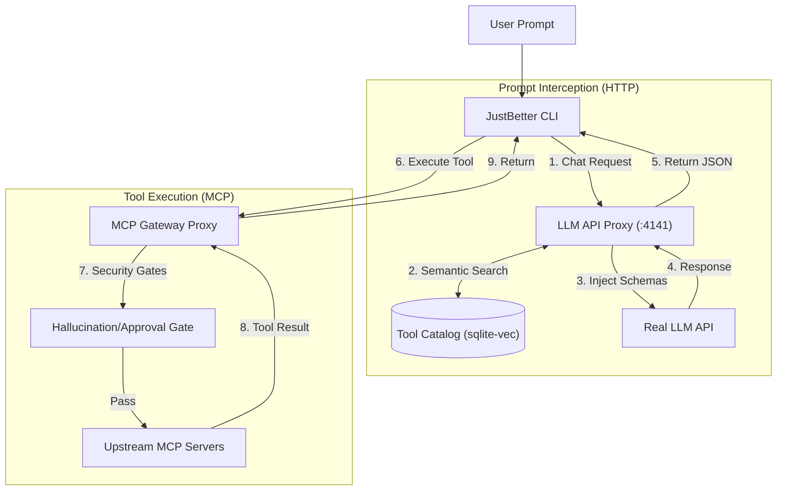
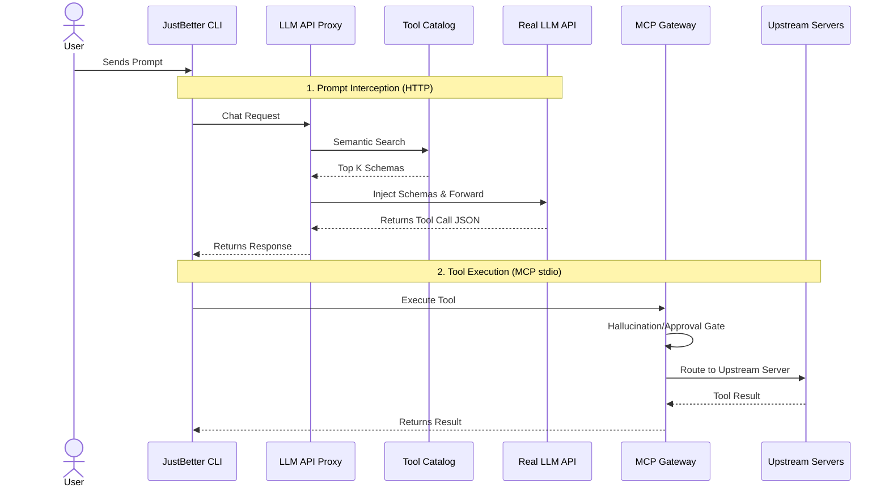
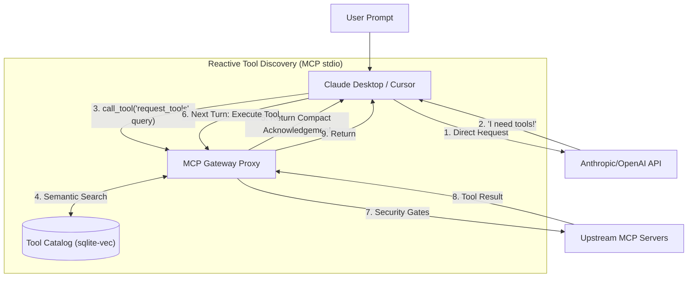
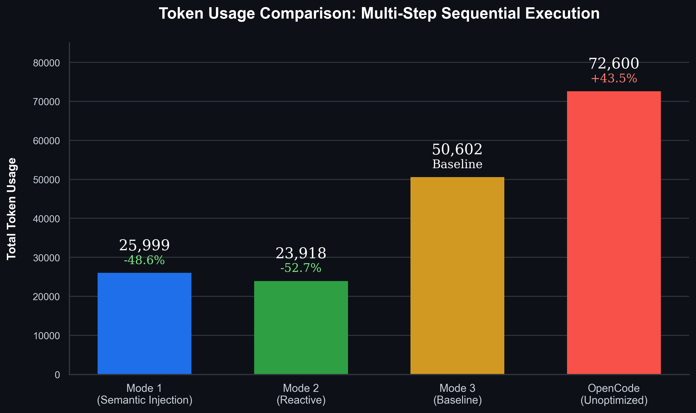
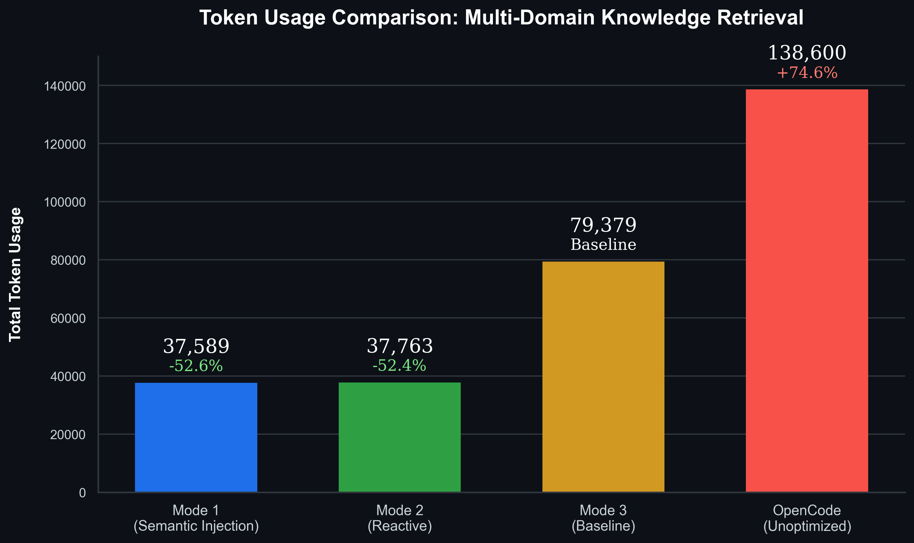

<div align="center">
  <h1>JustBetter MCP</h1>
  <p><em>An MCP gateway with dynamic, retrieval-based tool injection.</em></p>
  <p>
    
    
    
    
  </p>
</div>

<br/>

> **The Problem:** 
> Connecting an LLM to standard Model Context Protocol (MCP) servers (like a file system, a web searcher, and a database) dumps dozens or hundreds of tools into the LLM's context window. 
>
> This token-bloat problem leads to `node_modules` blowups, context limits being breached, and severely degraded tool selection accuracy.

> **The Solution:** 
> JustBetter MCP solves this by acting as a gateway/proxy. Instead of dumping every connected server's tools into every request, it uses dynamic, retrieval-based tool injection to limit the tools sent to the LLM. 
>
> It operates in two main modes: **Mode 2** is essentially equivalent to Anthropic's MCP Tool Search or OpenAI Codex's tool search, where the LLM reactively asks for tools mid-conversation. **Mode 1** is our custom approach that performs semantic retrieval on the raw prompt *before* the first LLM call. Mode 1 achieves almost the same results but can perform better, as the LLM doesn't have to spend inference time thinking about what tools to search for. For more details on this performance difference, see the [Case Study](#case-study-mode-1-vs-mode-2) section.

---

### Quick Links
- [Architecture & How It Works](#architecture--how-it-works)
- [Case Study (Mode 1 vs Mode 2)](#case-study-mode-1-vs-mode-2)
- [Setup & How to Use](#setup--quickstart)

---

## Architecture & How It Works

JustBetter MCP operates in two distinct modes depending on your configuration and client ecosystem.

### Mode 1: Semantic Prompt Injection (JustBetter CLI)

When using the JustBetter CLI with semantic injection enabled (`"semanticPromptInjection": true`), the gateway acts as a dual-proxy. It intercepts the HTTP chat request, performs a semantic search on the prompt, and silently injects the exact tools needed into the payload *before* it reaches the LLM.

#### Flowchart Style


#### Sequence Diagram Style


### Mode 2: Reactive Tool Discovery (Cursor, Claude Desktop & CLI)

This mode is used natively by third-party clients like Claude Desktop and Cursor, and can be enabled in the JustBetter CLI by setting `"semanticPromptInjection": false`.

In this mode, the gateway employs a reactive approach. It hides the massive catalog of upstream tools to prevent token bloat and exposes only a single `request_tools` primitive. The AI explicitly asks the Gateway for tools mid-conversation when needed. This mirrors the behavior of Anthropic's MCP Tool Search and OpenAI Codex's tool search, trading one extra round-trip for massive context savings.

#### Flowchart Style


#### Sequence Diagram Style


### Core Pipeline Security
Regardless of which mode you use, all tool executions pass through strict safety mechanisms:
- **Hallucination Gate:** Blocks the LLM from calling any tool that wasn't explicitly injected or requested.
- **Precondition Gate:** Skips and hides tools whose upstream server is disconnected or lacking required auth scopes.
- **Quarantine Mechanism:** Uses schema fingerprinting (SHA-256) to flag upstream tool changes. If a tool's schema unexpectedly changes, it's quarantined until human approval.

---

## Case Study: Mode 1 vs Mode 2

### Experiment Setup
- **Model:** `mistral-large-latest`
- **Connected Servers:** `filesystem`, `sqlite`, `websearch`, and `terminal`
- **Mode 3 (Baseline):** For comparison, we establish Mode 3 as the baseline scenario where semantic search is completely bypassed, and every available tool from all connected upstream servers is dumped directly into the context window.

### Prompt 1: Multi-Step Sequential Execution

**Prompt:** *"Run these one at a time, confirming the output of each before moving to the next: check the Node version, list the top-level npm packages installed, and check the current git status. Once you've confirmed all three, search the web for the current Node.js LTS version and tell me whether I should upgrade based on what you found."*

**Total Token Usage:**

<div align="center">
  
</div>

### Prompt 2: Multi-Domain Knowledge Retrieval

**Prompt:** *"Search the web for the latest release notes of the Model Context Protocol, check the open issues on the modelcontextprotocol/servers GitHub repo, and insert a summary row into a sqlite table called 'digest' (with columns 'source' and 'summary') for each of the two things you found."*

**Total Token Usage:**

<div align="center">
  
</div>

---

## Interpretations & Caveats

1. **Mode 1 vs. Mode 2 Performance:** Both Mode 1 (Semantic Injection) and Mode 2 (Reactive Discovery) achieve almost identical, highly optimized token efficiency. However, **Mode 1** holds a distinct advantage in output quality for complex or long-running tasks. By handling the semantic search and schema injection seamlessly in the proxy *before* inference, it eliminates the cognitive overhead of forcing the LLM to pause and reason about *which* tool to search for, preserving its reasoning capacity for solving the actual user task.
2. **The Inject-All Baseline (Mode 3):** As expected, simply dumping every available tool from all connected MCP servers directly into the prompt (Mode 3) performs the worst, consuming massive amounts of context and dragging down overall efficiency.
3. **OpenCode Comparison:** While OpenCode exhibits the highest token usage in these tests, an important caveat is that OpenCode's environment includes extensive built-in system prompts and default native tools that contribute to its token count. While it's not a perfect apples-to-apples comparison purely on tool overhead, it serves as a highly relevant real-world benchmark for the token-bloat problem JustBetter MCP was designed to solve.

---

## Setup & Quickstart

### Minimum Requirements
- **Node.js** (v18+)
- **npm**, **yarn**, or **pnpm**

### Configuration
Create a `config.json` in the project root. Here is an example format detailing the pinned tools list, upstream server list, and LLM proxy configuration:

```json
{
  "semanticPromptInjection": false,
  "injectAllTools": false,
  "apiProvider": "mistral",
  "upstreamServers": [
    {
      "name": "filesystem",
      "command": "npx.cmd",
      "args": [
        "-y",
        "@modelcontextprotocol/server-filesystem",
        "./"
      ]
    },
    {
      "name": "sqlite",
      "command": "npx.cmd",
      "args": [
        "-y",
        "mcp-server-sqlite-npx",
        "database.db"
      ]
    },
    {
      "name": "websearch",
      "command": "npx.cmd",
      "args": [
        "tsx",
        "src/websearch-server.ts"
      ]
    },
    {
      "name": "terminal",
      "command": "npx.cmd",
      "args": [
        "tsx",
        "src/terminal-server.ts"
      ]
    },
    {
      "name": "github",
      "command": "npx.cmd",
      "args": [
        "-y",
        "@modelcontextprotocol/server-github"
      ],
      "env": {
        "GITHUB_PERSONAL_ACCESS_TOKEN": "YOUR_GITHUB_PAT"
      }
    }
  ],
  "llmProxy": {
    "port": 4141,
    "geminiApiKey": "YOUR_GEMINI_API_KEY",
    "mistralApiKey": "YOUR_MISTRAL_API_KEY",
    "model": "mistral-large-2512"
  },
  "pinnedTools": [],
  "destructiveTools": [
    "delete_file",
    "drop_table"
  ]
}
```

### Running the Gateway & TUI
1. **Install dependencies:**
   ```bash
   npm install
   ```
2. **Start the gateway and dashboard:**
   ```bash
   npm run dev
   ```
   *(Or standard node execution depending on package.json scripts, e.g., `npx tsx src/cli.ts`)*
3. **Configure your AI Client:** Set your client (e.g. Cursor, Claude Desktop, or custom CLI) to use `http://localhost:4141/v1` as the OpenAI-compatible API base.
