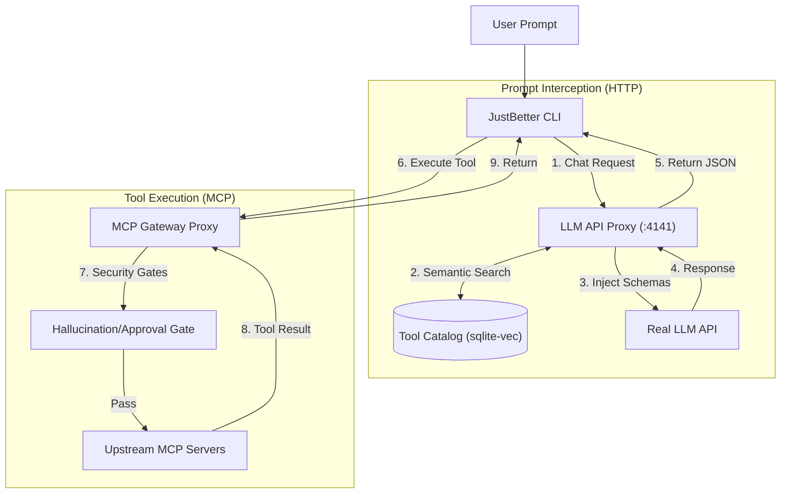
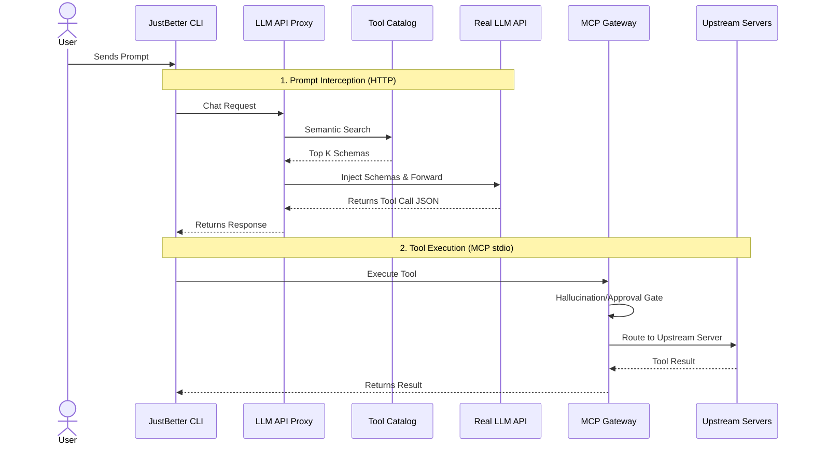
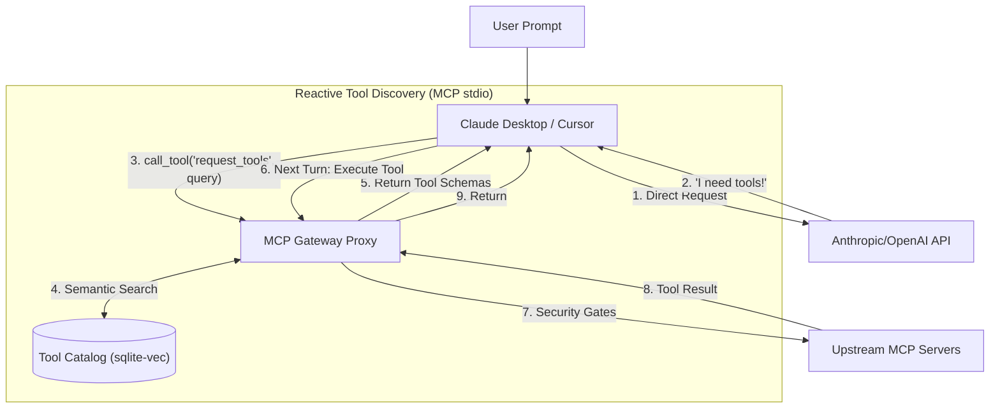
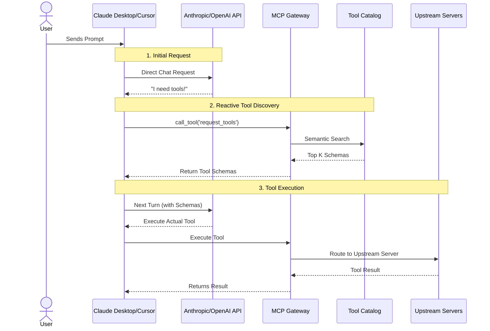

<div align="center">
  <h1>JustBetter MCP</h1>
  <p><em>An MCP gateway with dynamic, retrieval-based tool injection.</em></p>
  <p>
    
    
    
    
  </p>
</div>

<br/>

> **The Problem:** 
> Connecting an LLM to standard Model Context Protocol (MCP) servers (like a file system, a web searcher, and a database) dumps dozens or hundreds of tools into the LLM's context window. 
>
> This token-bloat problem leads to `node_modules` blowups, context limits being breached, and severely degraded tool selection accuracy.

> **The Solution:** 
> JustBetter MCP solves this by acting as a gateway/proxy. Instead of dumping every connected server's tools into every request, it intercepts the prompt, performs semantic search over the tool catalog, and injects *only* the relevant tools into the LLM API request. 
>
> *(Note: This architecture addresses the exact same problem Anthropic's MCP Tool Search and OpenAI Codex's tool search were built to solve, but implemented independently as a seamless local gateway. Unlike Anthropic's Tool Search and OpenAI Codex's equivalent, where the model itself decides when to search and composes its own query mid-conversation, this gateway performs semantic retrieval on the raw prompt before the first LLM call, trading some retrieval precision for zero extra round-trips on the common case.)*

---

### Quick Links
- [Results (Token Efficiency Case Study)](#case-study-token-efficiency)
- [Architecture & How It Works](#architecture--how-it-works)
- [Setup & How to Use](#setup--quickstart)

---

## Architecture & How It Works

Because third-party AI clients (like Claude Desktop) tightly control their LLM API requests, it is often impossible to intercept the user's prompt before it reaches the AI. To solve this, JustBetter MCP operates in two distinct modes depending on your client.

### Mode 1: The JustBetter CLI (Ideal Architecture)

When using our custom Terminal App, the gateway acts as a dual-proxy. It intercepts the HTTP chat request, performs a semantic search on the prompt, and silently injects the exact tools needed into the payload *before* it reaches the LLM.

#### Flowchart Style


#### Sequence Diagram Style


### Mode 2: Cursor & Claude Desktop (Reactive Fallback)

**Why the difference?** In a perfect world (Mode 1), we search the catalog and inject schemas before the LLM ever sees the request, costing zero extra inference turns. However, closed-ecosystem clients like Claude Desktop do not allow you to reroute their core LLM API traffic through a local proxy. They only allow connecting standard MCP servers.

Since we cannot intercept the prompt for these clients, we employ a reactive fallback. We hide the massive catalog of upstream tools to prevent token bloat, and expose only a single `request_tools` primitive. The AI is forced to explicitly ask the Gateway for tools mid-conversation, trading one extra round-trip for massive context savings.

#### Flowchart Style


#### Sequence Diagram Style


### Core Pipeline Security
Regardless of which mode you use, all tool executions pass through strict safety mechanisms:
- **Hallucination Gate:** Blocks the LLM from calling any tool that wasn't explicitly injected or requested.
- **Precondition Gate:** Skips and hides tools whose upstream server is disconnected or lacking required auth scopes.
- **Quarantine Mechanism:** Uses schema fingerprinting (SHA-256) to flag upstream tool changes. If a tool's schema unexpectedly changes, it's quarantined until human approval.

---

## Case Study: Token Efficiency

**Model:** Mistral-Large  
**Prompt:** *"Search the web for the current top 5 trending open-source LLM models. Create a new SQLite database file named ai_trends.db, create a table called models with columns for 'name' and 'description', and insert the 5 models you found. Finally, write a markdown file called summary.md in the current directory that lists the models and confirms the database was successfully updated."*  
**Connected Servers:** Filesystem, SQLite, Websearch, Terminal  

**Why this prompt?**  
This prompt was specifically chosen because it forces a multi-step, multi-server workflow. It requires web access, database operations, and filesystem writes. Normally, this forces the gateway to dump every single tool from all four MCP servers into the context window at once, creating a massive token payload. 

### Trace & Token Usage Comparison

| Configuration | Token Usage | Context Savings |
| :--- | :--- | :--- |
| **OpenCode (Unoptimized, same servers)** | 133.9K | Base |
| **OpenCode (Default tools)** | 125.5K | +6.27% |
| **JustBetter MCP (Injection Disabled / Fallback Only)** | **116.9K** | **+12.7%** |
| **JustBetter MCP (Dynamic Injection)** | **74.5K** | **+44.3%** |

*Note: The massive gap between the last two configurations explicitly proves that dynamic semantic injection works by reducing the cognitive load on the LLM. Without it, the LLM wastes significant tokens thinking, planning, and explicitly requesting tools across extra turns. Dynamic injection eliminates this overhead entirely by handing the LLM exactly what it needs on turn 1.*

*Caveat:* This is an early result on a single-task scope with a relatively small setup. The OpenCode token count also includes harness-overhead confounds, but the trend clearly demonstrates the context savings of dynamic injection.

---

## Honest Limitations & Caveats

- **Retrieval is on Raw Prompt Text:** Semantic search uses the raw user prompt, not model-composed queries. If the user prompt is vague, retrieval might miss initially (though the `request_tools` fallback catches this).
- **Scaling Savings:** Context token savings scale massively with large catalogs (e.g., Playwright + GitHub + DB), but shrink or become negligible on very small setups or short sessions where the tool schemas are small anyway.
- **Conversation History Pruning:** The conversation history itself isn't pruned yet, meaning long-running agentic loops will still eventually hit context limits from message history alone, even if the tools array is optimized.

---

## Setup & Quickstart

### Minimum Requirements
- **Node.js** (v18+)
- **npm**, **yarn**, or **pnpm**

### Configuration
Create a `config.json` in the project root. Here is an example format detailing the pinned tools list, upstream server list, and LLM proxy configuration:

```json
{
  "semanticPromptInjection": true,
  "apiProvider": "mistral",
  "llmProxy": {
    "port": 4141,
    "geminiApiKey": "YOUR_GEMINI_API_KEY",
    "mistralApiKey": "YOUR_MISTRAL_API_KEY",
    "model": "mistral-large-latest"
  },
  "pinnedTools": ["request_tools"],
  "destructiveTools": ["delete_file", "drop_table"],
  "upstreamServers": [
    {
      "name": "filesystem",
      "command": "npx.cmd",
      "args": ["-y", "@modelcontextprotocol/server-filesystem", "./"]
    },
    {
      "name": "sqlite",
      "command": "npx.cmd",
      "args": ["-y", "mcp-server-sqlite-npx", "database.db"]
    }
  ]
}
```

### Running the Gateway & TUI
1. **Install dependencies:**
   ```bash
   npm install
   ```
2. **Start the gateway and dashboard:**
   ```bash
   npm run dev
   ```
   *(Or standard node execution depending on package.json scripts, e.g., `npx tsx src/cli.ts`)*
3. **Configure your AI Client:** Set your client (e.g. Cursor, Claude Desktop, or custom CLI) to use `http://localhost:4141/v1` as the OpenAI-compatible API base.
